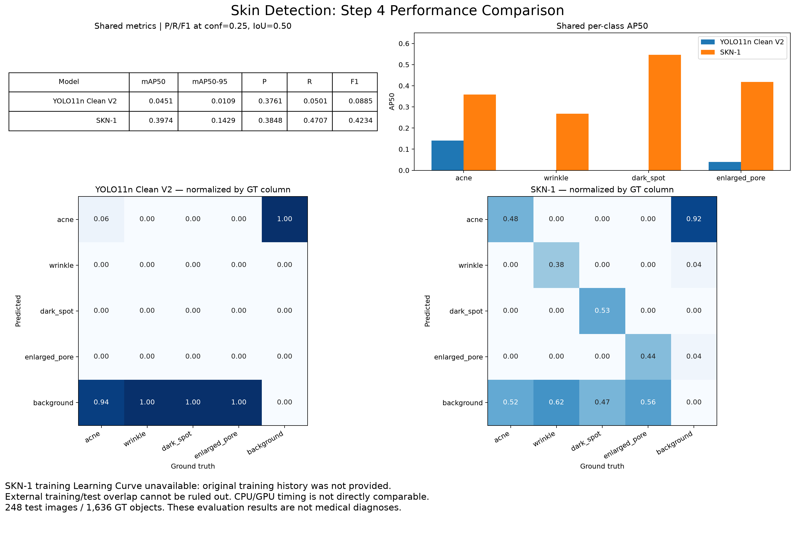
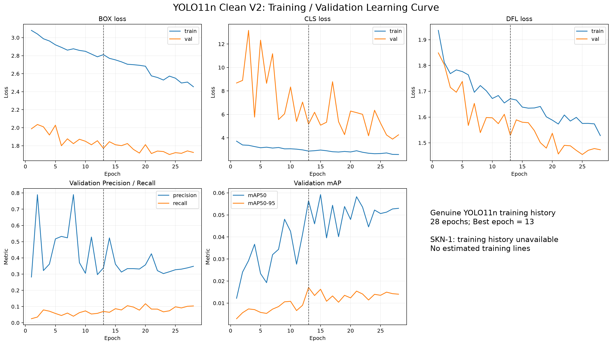
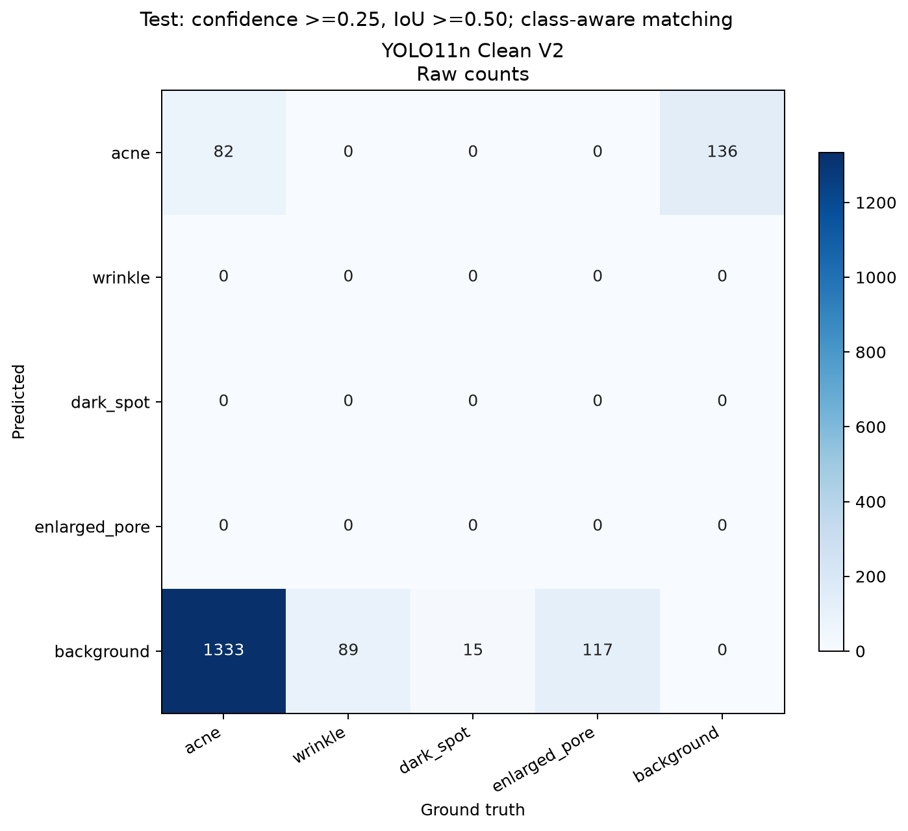
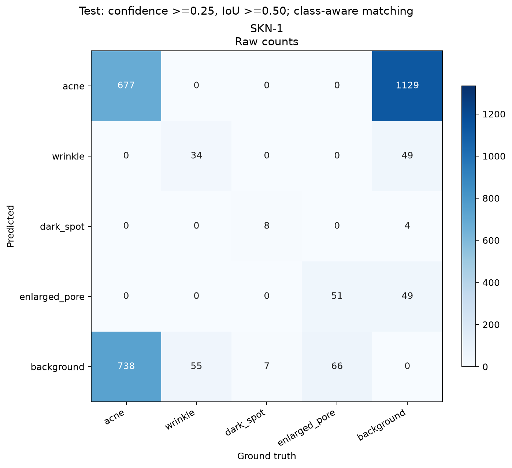
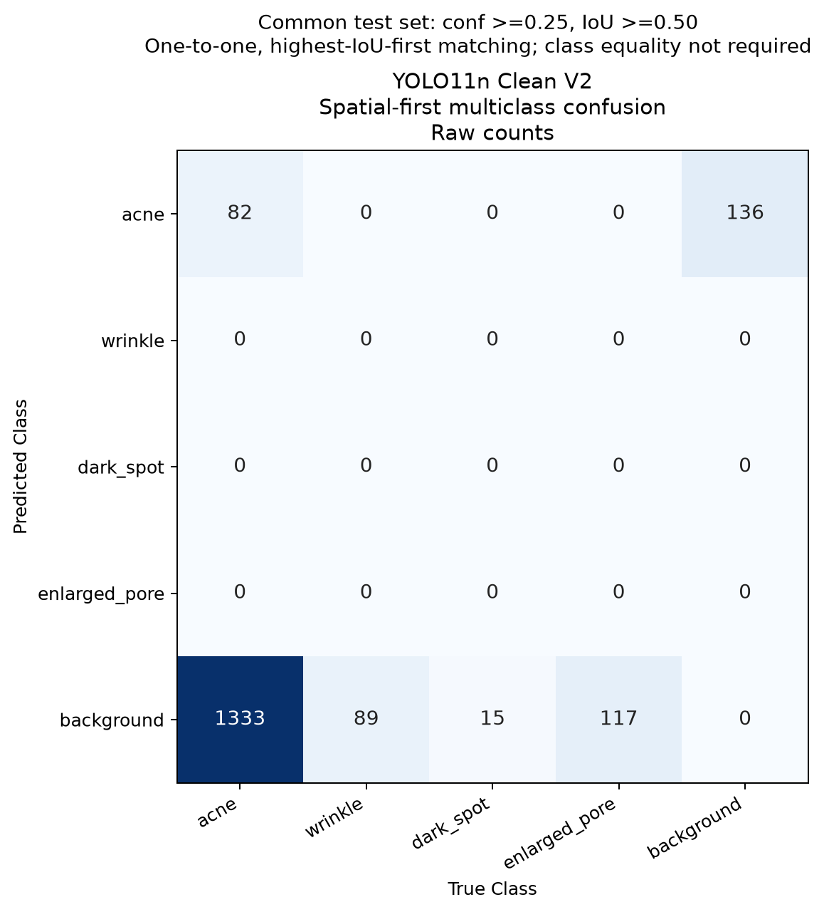
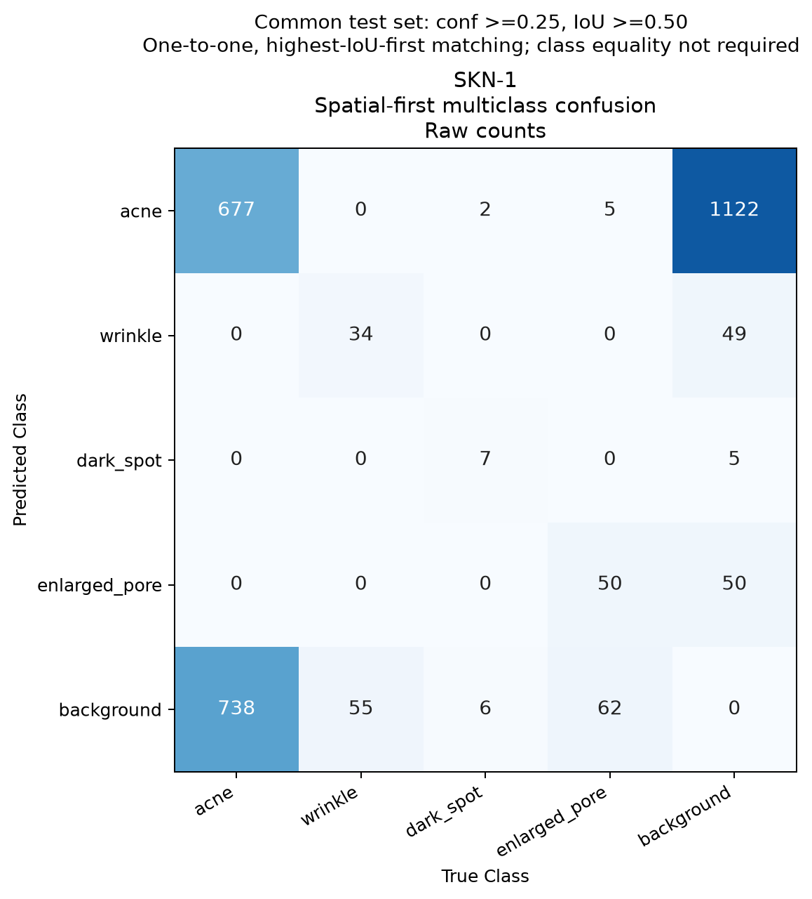
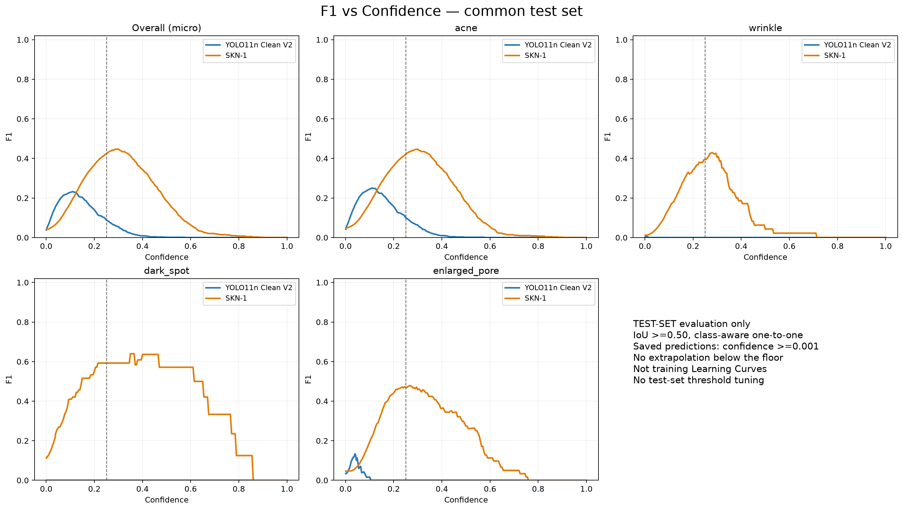
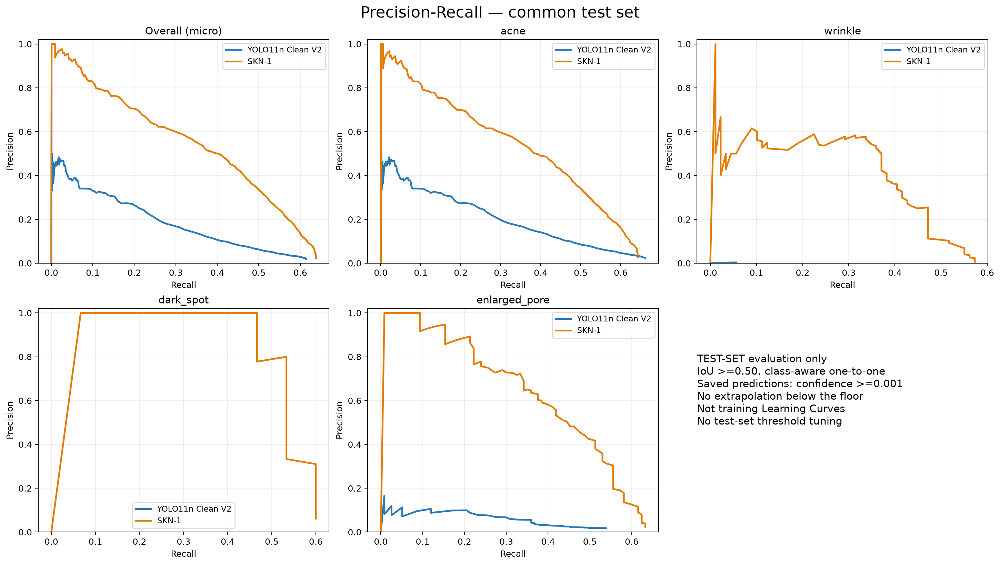

# Step 4: Evaluate and display Performance Metrics

## 1. Load / identify best model

YOLO11n: `runs\detect\results\training_v2\yolo11n_clean\weights\best.pt`. SKN-1: `skn-1/2`, external YOLO-NAS. No inference, training or fine-tuning was rerun; Phase 5B exports are reused.

## 2. Performance Metrics

Primary mAP: shared COCOeval from Phase 5B. Secondary P/R/F1: class-aware one-to-one matching at confidence >=0.25 and IoU >=0.50. Tables: tables/performance_metrics.csv and tables/per_class_metrics.csv.

## 3. Learning Curve

YOLO11n: genuine 28-epoch training/validation history, Best epoch = 13 (highest recorded validation mAP50-95). Original results.png was copied byte-identically. SKN-1 Training Learning Curve: NOT AVAILABLE; original epoch logs absent. No estimated lines.

## 4. Confusion Matrix

### A. Class-aware TP/FP/FN view (Phase 5B operating-point metrics)

Both share identical test set, mapping, thresholds and Phase 5B matching rule. Rows=predicted, columns=ground truth; normalized versions normalize each GT column. Background row=FN; background column=FP. There are no detection TN counts. Class-aware matching means wrong-class detections count as FP+FN, not class-to-class off-diagonal confusion. This is not the historical Ultralytics confusion-matrix algorithm.

### B. Spatial-match multiclass view (Phase 5C.1)

Additional raw PNG, GT-column-normalized PNG and numeric CSV are provided for each model with the suffix `_class_confusion`. Existing class-aware matrices remain byte-identical.

Use the same 248 images, four canonical classes, confidence >=0.25 and IoU >=0.50. Match boxes spatially BEFORE checking class equality: sort eligible pairs by descending IoU, then greedily accept a pair only if both GT and prediction are unmatched. Resolve exact ties by original GT index then prediction index. Each object participates at most once. This is closer in interpretation to Chapter 8_2 / Ultralytics confusion_matrix.png, but is not claimed to reproduce every version-specific Ultralytics matching detail.

Rows = Predicted Class, columns = True Class, ordered acne / wrinkle / dark_spot / enlarged_pore / background. Diagonal = correct-class spatial matches; off-diagonal = wrong-class spatial matches; background row = unmatched GT; background column = unmatched predictions. Normalize by each GT column, including background (its normalized column is the distribution of unmatched predictions). Background/background is 0; detection true negatives are undefined.

| Model | Correct-class matches | Wrong-class matches | Unmatched GT | Unmatched predictions | GT accounted |
|---|---:|---:|---:|---:|---:|
| YOLO11n Clean V2 | 82 | 0 | 1554 | 136 | 1636 |
| SKN-1 | 768 | 7 | 861 | 1226 | 1636 |

SKN-1 off-diagonal entries: predicted acne / true dark_spot = 2; predicted acne / true enlarged_pore = 5. Spatial-first matching can let a higher-IoU wrong-class prediction take a GT that class-aware matching would assign differently. Thus SKN's diagonal is 768 rather than the previous class-aware 770, and unmatched counts differ. YOLO's matrix happens to be numerically identical; no cross-class match was selected at this operating point. Do not replace Phase 5B P/R/F1 with values inferred from this new matching rule. All existing shared and historical metrics remain unchanged.

Validation: correct + wrong + unmatched GT = 1636 for each model. Per-class GT column totals remain 1415 / 89 / 15 / 117. Matched + unmatched predictions = 218 (YOLO) / 2001 (SKN). Matching configuration and preservation hashes are recorded in confusion_matrices/class_confusion_validation.json.

## 5. F1 / PR curves

Additional precision/recall vs confidence figures and numerical curve points are included. These are TEST-SET evaluation curves, not training Learning Curves or COCO AP interpolation. Confidence range starts at the saved 0.001 floor. Do not use test curves to tune thresholds.

## 6. Prediction examples

8 deterministic comparison examples: GT / YOLO / SKN at confidence >=0.25. selection_manifest.json records selection criteria: four class-coverage cases, both-model TP, YOLO-only TP, SKN-only TP and both-model miss. This illustrative set is not an unbiased sample.

Curve convention: Precision and F1 are recorded as 0 when there are no retained predictions (zero-division convention); this does not imply false positives at those thresholds. PR figures show raw operating-point samples, not interpolated COCO AP curves. No threshold was selected or tuned from the test curves.

## 7. Model comparison

SKN-1 has higher shared AP in all four classes on this test set. YOLO11n: 2,582,932 parameters, recorded 6.4 GFLOPs. SKN parameter count: N/A. Inference timing and backend metadata are in tables/model_information.json; CPU vs GPU is not a fair speed comparison.

## 8. Limitations

External SKN-1 training-data overlap with our test set cannot be completely ruled out. Minority-class support is small (dark_spot 15, wrinkle 89 objects). SKN original training history is unavailable. Prediction preprocessing/NMS differ by model; historical Ultralytics val uses multi-label NMS whereas saved YOLO predict exports use single-label NMS. Historical results were preserved, not substituted into shared tables. No medical diagnostic claim.

Reference mapping: results.png -> genuine learning curve + preserved original; confusion_matrix.png -> common-test matrices; BoxF1_curve.png -> test F1 comparison; val_batch0_pred.jpg -> three-panel prediction examples.
